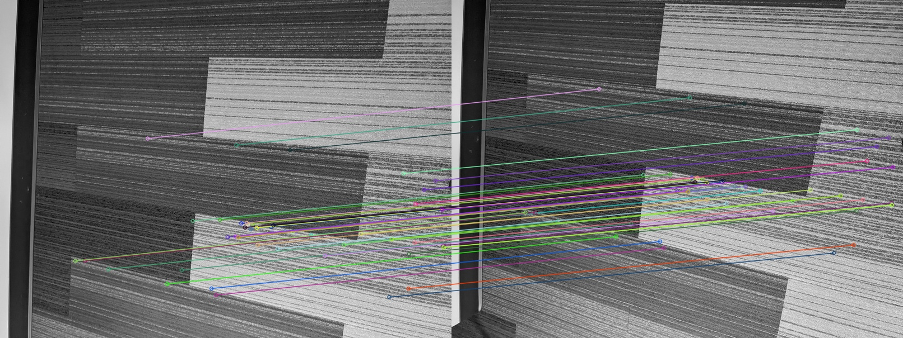
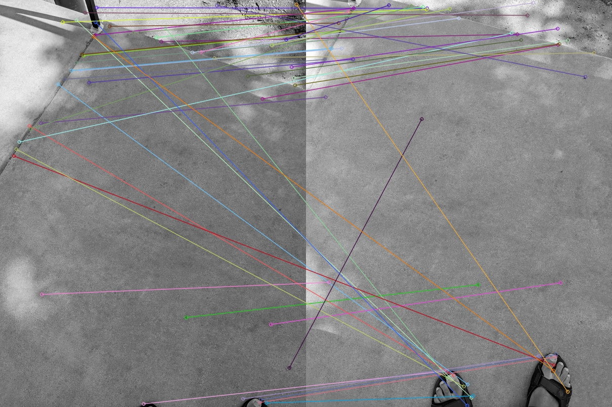

# Why Using SIFT feature based matching is not accurate for our application

We detected and matched SIFT features of two photos of a desktop. 
The matching is pretty accurate (mostly)

Then we detecte and matched SIFT features from two photos of a floor with a pattern. 
The matching is still pretty good.

Then we detecte and matched SIFT features from two photos of a curb.\
In this case the SIFT based matching fails miserably.\
Either we have to resort to another method or implement a way to ignore the incorrect matches.

