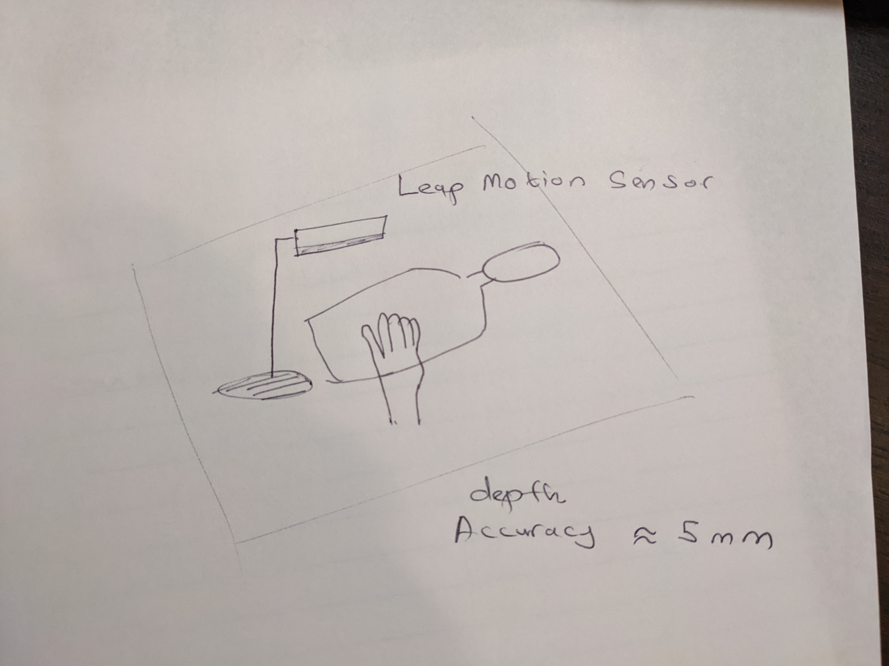
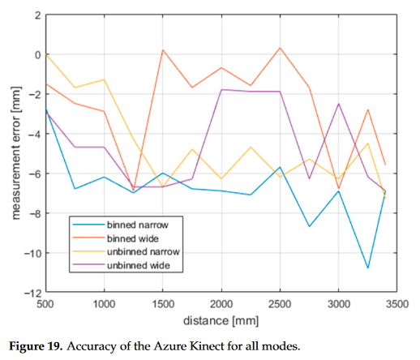

# Using Leap Motion sensor to track hands

From the paper 
"Analysis of Precision and Stability of Hand Tracking with Leap Motion Sensor" by Vysocky et.al,
the depth measuring accuracy of Leap Motion sensor can be around 5mm depending on the correct placement.

website of the sensor : https://www.ultraleap.com/
tracking depth between 10cm to 60cm prefered, upto 80cm maximum. 
 

## Proposed settup of the sensor 

We can place the sensor so that the hand is in its capable range. 

Price is around $110 from Adafruit

## Alternatives 
### Azure Kinet 
From paper
"Evaluation of the Azure Kinect and Its Comparison to Kinect V1
and Kinect V2" by Tolgyessy et.al:

successor of Kinet V1 and V2
1 continuous wave Time of flight camera
1 color camera
measuring distance around 0.5 - 3m
Sensor needs to warm up around 80 minutues to stabilize for high accuracy

Price is around $600

 

