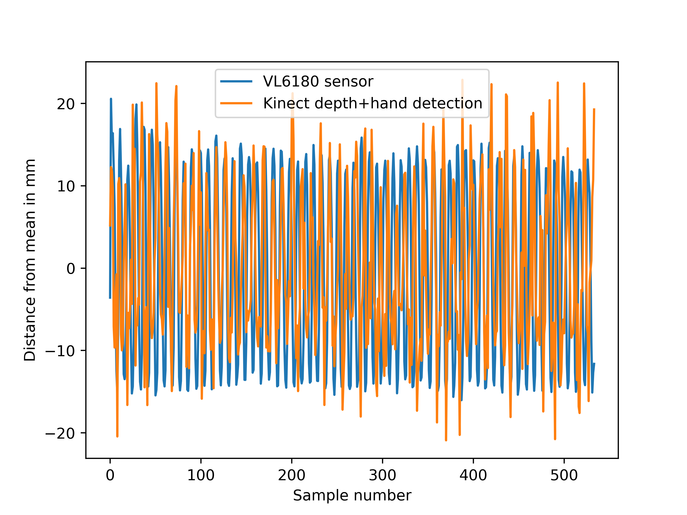

# How to measure depth with Azure kinect and depth sensor
## Step 1 do CPR and capture video with Azure Kinect
1. Run the azurekinect/stream/stream.exe that captures IMU+depth+RGB stream from azure kinect camera \
e.g: \ 
C:\Users\lahir\code\CPRquality\azurekinect\stream\stream.exe C:\\Users\\lahir\\CPRdata\\vid.mkv C:\\Users\\lahir\\CPRdata\\ 600 \
argument 1 : output file (.mkv contains all the data (IMU+depth+RGB)) \
argument 2 : number of frames that the capture captures data (time period depends on the frame rate setting which is either 15 or 30 frames per seconds. Edit azurekinect\stream\stream.cpp to change this)

2.  Run azurekinect/IMUreader/IMUreader.exe to extract the IMU data from the captured .mkv file \
C:\Users\lahir\code\CPRquality\azurekinect\IMUreader\IMUreader.exe C:\\Users\\lahir\\CPRdata\\ C:\\Users\\lahir\\CPRdata\\vid.mkv \
argument 1 : output data directory \
argument 2 : input data file \
output : acc.csv and gyro.csv that contains timestamped accelerometer and gyroscope data \
format : \
timestamp,x_value, y_value   , z_value \
200333,5.52886009,-0.02718589,-8.26961422

3. Run azurekinect/extractdata/extractdata.exe to extract point cloud data from the captures Azure kinect data \
e.g : \ 
C:\Users\lahir\code\CPRquality\azurekinect\extractdata\extractdata.exe C:\\Users\\lahir\\CPRdata\\vid.mkv C:\\Users\\lahir\\CPRdata\\outputs\\transformed\\  \
argument 1 : input data .mkv file \
argument 2: output data directory \
output : for each frame of the data file, (frame rate is either 30 or 15 frames per second depending on the setting used. To change this, edit azurekinect\stream\stream.cpp) this calculates a point cloud file (custom format). \
Format of the point cloud file (.ptc) : \
-1028,-587,1012,-1027,-588,1013,-1026,-589,1014,-1025,-588,1014,-1024, \ 
(value[0],value[1],value[2]) are the x,y,z positions for the first pixel of the RGB image. \

## Step 2 : Visually extract the CPR depth 
The code for this is in demo.py \ 
In this code, 
1. We extract frames (RGB images) from the video with ffmpeg (see the code) \
2. Use Google media pipe to extract wrist position of the top hand (this process needs more fine-tuning) \
3. Get the (x,y,z) position relavent to the wrist position from the relavent point cloud file \
4. Calculate the direction of gravity from accelerometer data file \ 
5. Calculate the the verticle distance to the wrist from camera (project xyz positions in the direction of gravity)

## Experiment 1 : compare the depth measurements from VL6180 sensor fixed in the duummy and point clouds from Kinect
1. Read the VL6180 data using readdistsensor.py /
See code in demo.py (datacollect git branch) on how to get the following plot \ 

